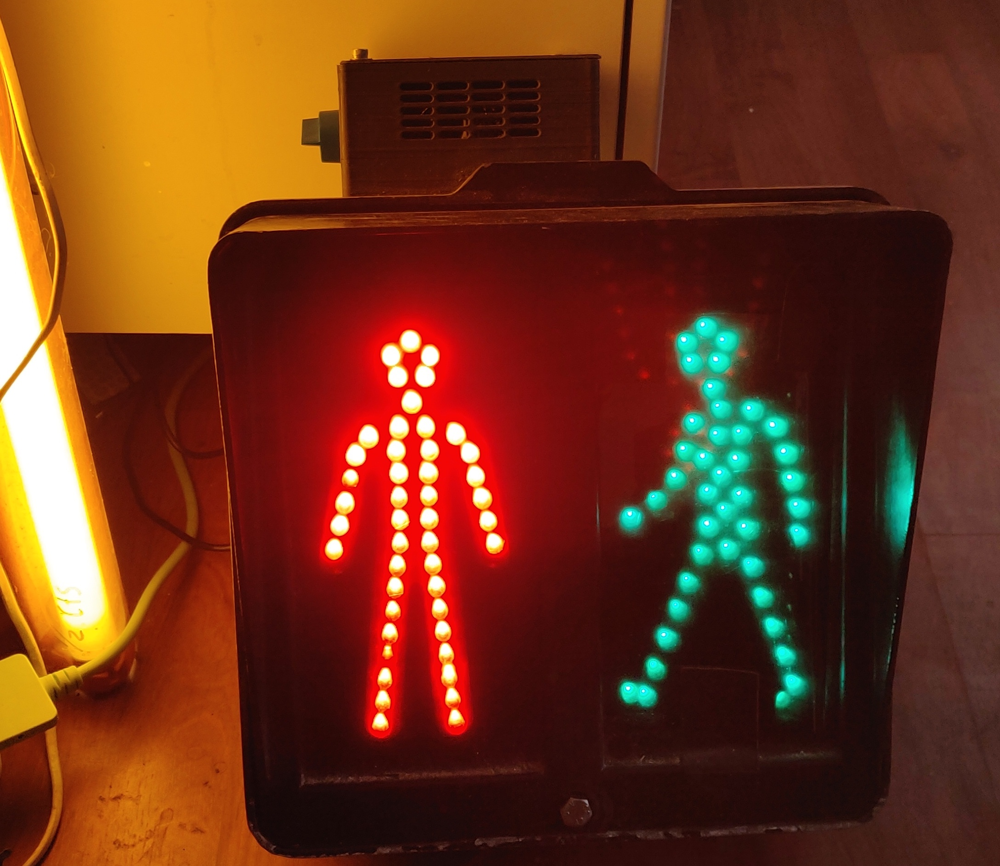
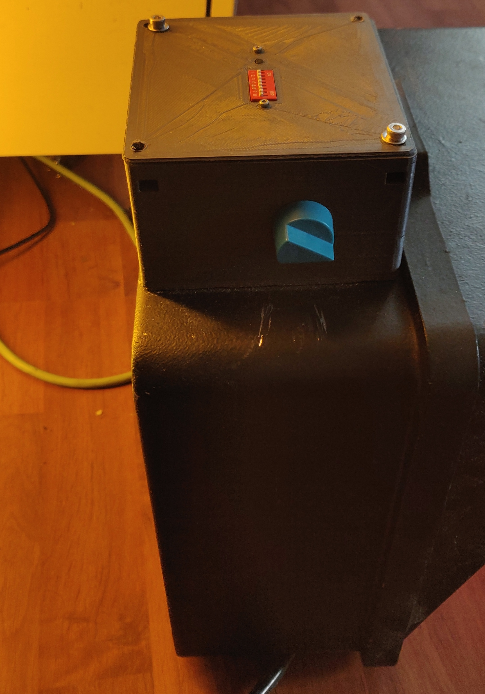
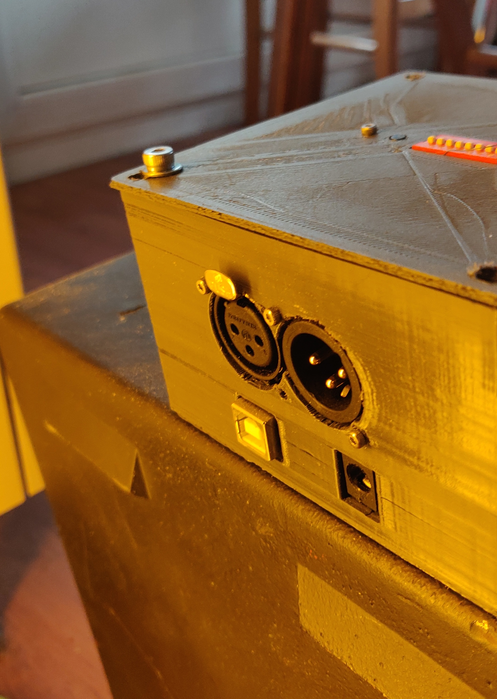
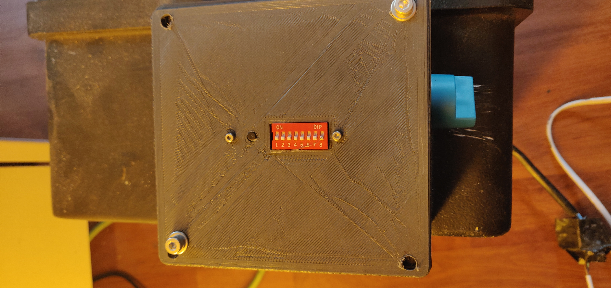
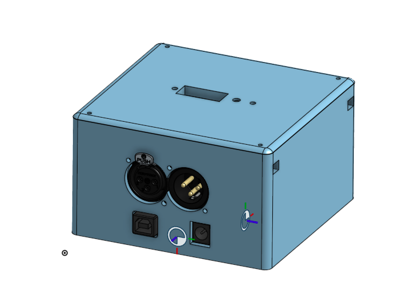

# DMX Traffic light

This repository contains the code for an Arduino UNO used as a DMX slave to control a traffic light found in the streets.

## Presentation

The 8 pin switch on top of the box control allow to select the DMX adress, if the address is set to 0, the box will work in strobo mode. In this mode the potentiometer on the side of the box control the frequency of the stroboscope.

|   |   |
|---|---|
|   |   |

## The enclosure

The enclosure model can be found [Here](https://cad.onshape.com/documents/5131ef4fd89604ad79183158/w/fa3255602ebe765a22643be1/e/97975a5d2dfca5557aa9c980)

## Extras 

This light has been donated to the [Garage 83-C](https://www.facebook.com/Garage83C/). It can be found in the scenography of their events :) 